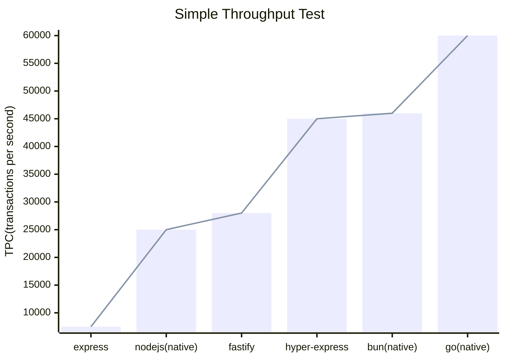
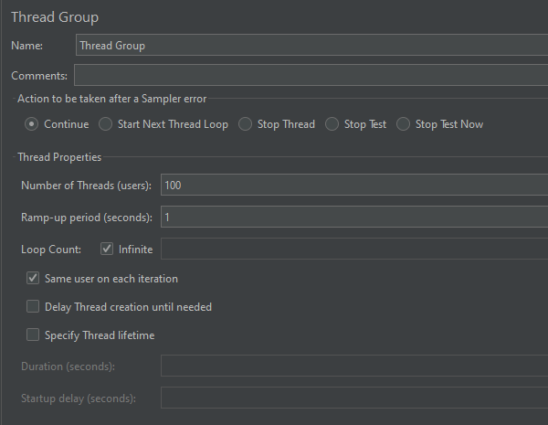

# HTTP Server Performance test

## Test Results

|        | type                                       | transactions per second |      |
| ------ | :----------------------------------------- | ----------------------- | ---- |
| Nodejs | [express](./nodejs/express.js)             | 7500                    |      |
|        | [native](./nodejs/native.js)               | 25000                   |      |
|        | [fastify](./nodejs/fastify.js)             | 28000                   |      |
|        | [hyper-express](./nodejs/hyper-express.js) | 45000                   |      |
| Bun    | [native](./bun/native.ts)                  | 46000                   |      |
| Go     | [native(net/http)](./golang/nethttp.go)    | 60000                   |      |
| Rust   | [native](./rust/native)                    | not yet                 |      |
|        | [actix](./rust/actix)                      | not yet                 |      |

## Test Environment 

- CPU: 5600x
- RAM: 16gb
- OS: windows 11

