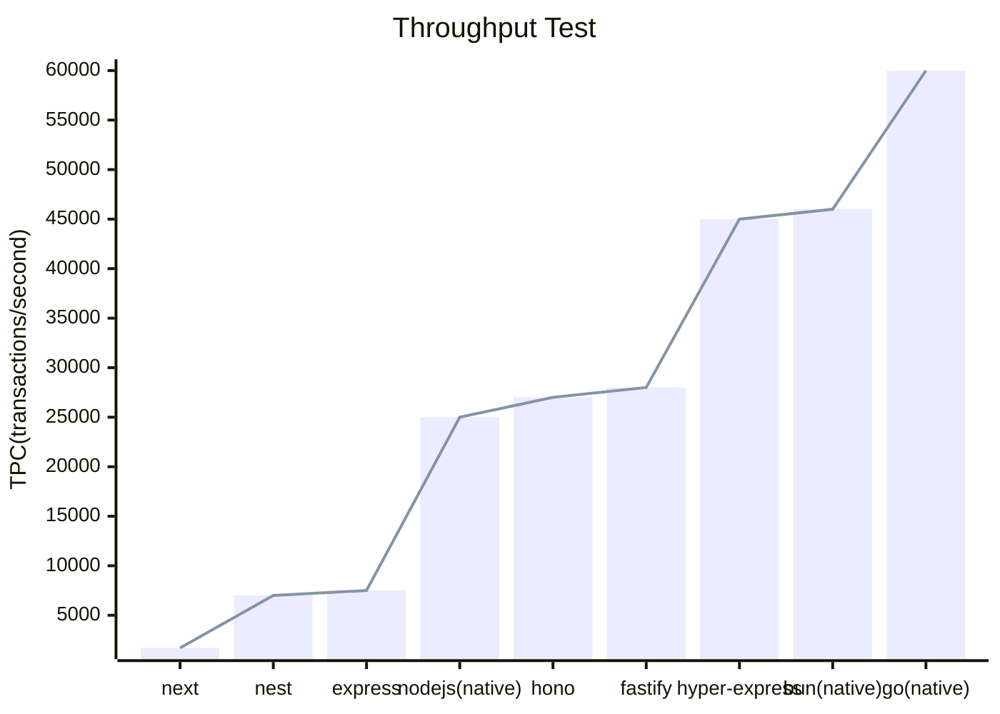

# HTTP Server Performance test

## Test Results

|          | type               | transactions per second |      |
| -------- | :----------------- | ----------------------- | ---- |
| **Node** | next(app router)   | 1700                    |      |
|          | nest(with express) | 7000                    |      |
|          | express            | 7500                    |      |
|          | native             | 25000                   |      |
|          | hono               | 27000                   |      |
|          | fastify            | 28000                   |      |
|          | hyper-express      | 45000                   |      |
| **Bun**  | native             | 46000                   |      |
| **Go**   | native(net/http)   | 60000                   |      |
| **Rust** | native             | not yet                 |      |
|          | actix              | not yet                 |      |

## Test Environment 

- CPU: 5600x
- RAM: 16gb
- OS: windows 11

